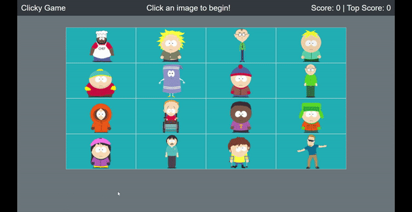

# Clicky Game

This is a memory game in which you can't click on the same picture twice. Each time you click on an image, the order is shuffled. The app keeps track of your current score, and the top score.

## Deployed Link

https://yjmiranda.github.io/clicky-game/

## Code Snipets 
```jsx
  const [clicked, setClicked] = useState([]);
  const [message, setMessage] = useState({
    text:"Click an image to begin!",
    textColor: ""
  });
  const [score, setScore] = useState(0);
  const [topScore, setTopScore] = useState(0);
```
These are the state hooks that the app keeps track of. The first keeps track of an array of the id's of the images that have been clicked, the second keeps track of the the message that is displayed in the middle of the header, the third keeps track of the current score, and the fourth keeps track of the top score.
```jsx
  const handleClick = id =>{
    if(clicked.includes(id)){
      setMessage({
        text:"You guessed incorrectly!",
        textColor:"text-danger"
      });
      setScore(0);
      setClicked([]);
    } else{
      setMessage({
        text:"You guessed correctly!",
        textColor:"text-success"
      });
      let array = clicked;
      array.push(id);

      let number = score;
      number++;

      setClicked(array);
      if(number > topScore){
        setTopScore(number);
      }
      setScore(number);
    }
  }
```
These is the function that handles what happens when an image is clicked. If the image has not been clicked yet, the message displays as "You guessed correctly!". Also the id of the image is pushed into the "clicked" array, the score is increased by one, and the top score is increased if it is lower than the current score. If the image has already been clicked, the message displays as "You guessed incorrectly", the current score is reset to 0, and the clicked array is emptied.

## Live Demo



## Built With
* [React](https://reactjs.org/)
* [node.js](https://nodejs.org/en/)
* [Bootstrap](https://getbootstrap.com/)
* [HTML](https://developer.mozilla.org/en-US/docs/Web/HTML)
* [CSS](https://developer.mozilla.org/en-US/docs/Web/CSS)
* [Javascript](https://developer.mozilla.org/en-US/docs/Web/JavaScript)
* [Git](https://git-scm.com/)
* [GitHub](https://github.com/)
* [VSCode](https://code.visualstudio.com/)

## Author

**Yalí Miranda** 

* [Github](https://github.com/yjmiranda)
* [LinkedIn](https://www.linkedin.com/in/yal%C3%AD-miranda-8b4b94199/)
* [Portfolio](https://yali-miranda-portfolio.herokuapp.com/)